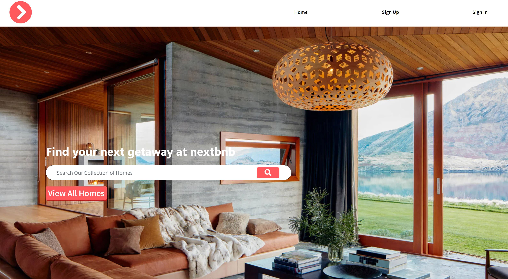

# NextBnb - Client

This application allows users to view properties and manage bookings on those
properties as they plan their next travel adventure!

## Important Links

- [NextBnb Django API](https://nextbnb-api.herokuapp.com/)

- [NextBnb Client](https://gambinos14.github.io/nextbnb-client/#/)

## Homepage View

## Planning Story

This capstone project was a way for me to challenge myself to try and reproduce
an MVP version of a site that I use ALL the time. I decided that given the short
time frame, I would focus on doing CRUD on a single resource while setting the
application up to be able to handle CRUD on multiple other resources.

In the end, I decided to build a clone of AirBnb which allows users to manage
travel bookings on the existing properties within the app. The biggest challenge
with this project was working with date ranges on the booking model.

There were a couple things that I needed to include in order to make the app useful
and functional: users could not make bookings on the same dates and if a user
wanted to update a booking, I had to free up those dates in the existing property
bookings.

I discovered that there are SEVERAL different ways that JavaScript and Python on
the backend handle dates, so it was a process of trial and error to try and create
the logic described above.

Apart from this, the CSS styling in this project was another challenging
aspect; however, in the end it came out pretty acceptable.

### User Stories

*As an unregistered user, I would like to sign up with email and password.
*As a registered user, I would like to sign in with email and password.
*As a signed in user, I would like to change password.
*As a signed in user, I would like to sign out.
*As a signed in user, I would like to make a reservation at my favorite property.
*As a signed in user, I would like to be able to update my reservation.
*As a signed in user, I would like to cancel a reservation.
*As a signed in user, I would like to see all my reservations.
*As a signed in user, I would like to view individual reservation details

### Technologies Used

- ReactJS
- JavaScript
- HTML
- CSS
- CSS Sass
- Ajax (Axios)
- Bootstrap
- Google Maps API

### Unsolved Problems/Future Updates

- Would like to do some CSS fine tuning to fix the positioning of certain
elements on the different views.
- Would like to eventually allow users to add comments and rate properties.
- Would like to eventually make the site mobile responsive.

#### Wireframe and ERD

- [Wireframe and ERDs ](https://docs.google.com/document/d/1Pk_ML21nfQIxZaxbK4QNUWwwAYiqOJhJ7Ier5KqV4WY/edit?usp=sharing)
